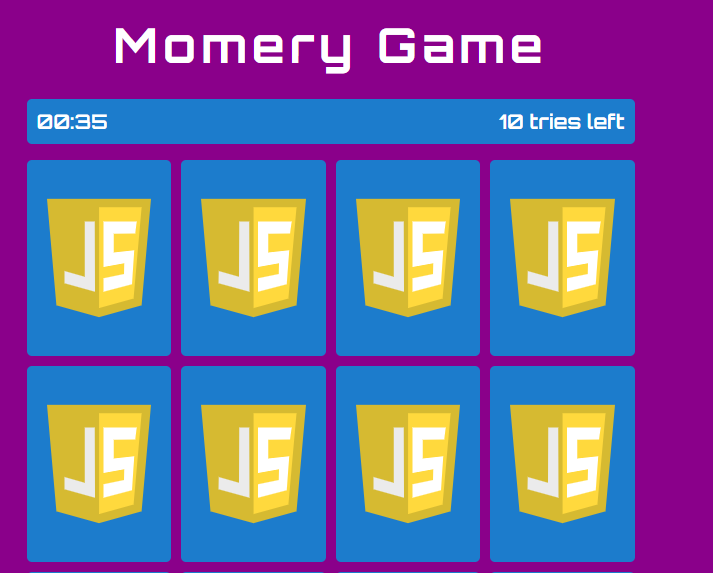
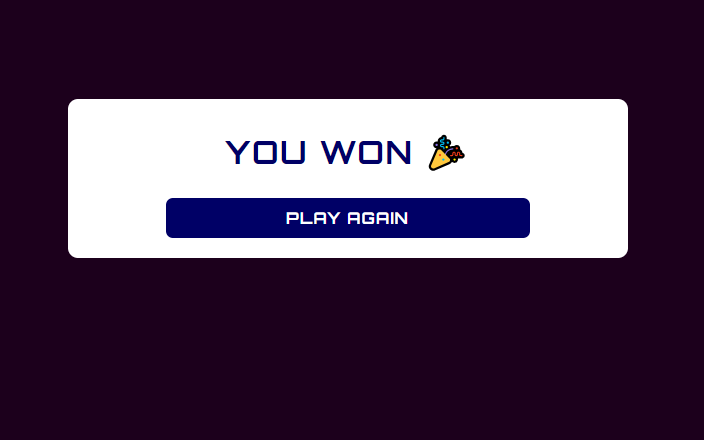
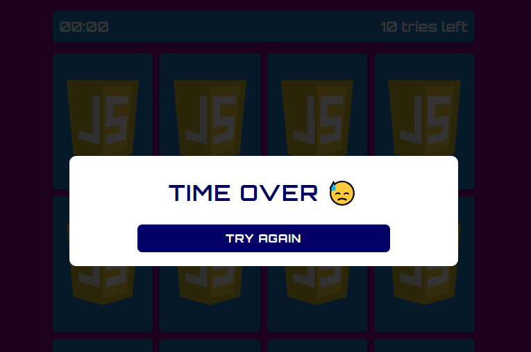

# Memory Game

In this memory game, players are presented with a grid of face-down cards. The objective is to find matching pairs by flipping over two cards at a time. Here are some key features:

- **Timer**: The game includes a timer that starts when the player begins the game. The challenge is to complete the game as quickly as possible.
- **Number of Tries**: Players have a limited number of tries (or moves) to find all the matching pairs. If they exceed this limit, the game ends.
- **Win Condition**: The game ends when all pairs are successfully matched or when the player runs out of tries or time.

## Used Technology

- HTML (Hypertext Markup Language)
- CSS (Cascading Style Sheets)
- JavaScript

## Live Demo

[Play Memory Game](https://omr-muhammad.github.io/js_games-memory/)

## Screenshots

## Installation Instructions

1. Clone this repository.
2. Open `index.html` in your web browser.

## Contributing

Contributions are welcome! Please submit pull requests or report issues.
